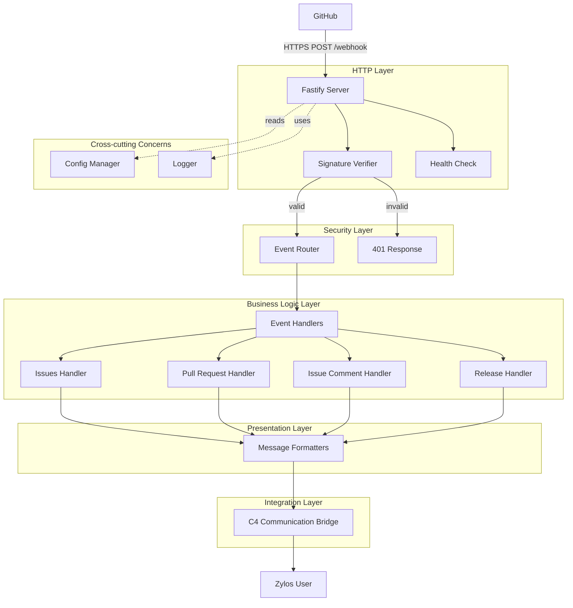

<!-- generated-by: gsd-doc-writer -->
# Architecture

## System Overview

Zylos GitHub Connector 是一个单向事件驱动的 Webhook 接收器，用于将 GitHub 事件转换为 Zylos AI Agent 平台的通知消息。系统采用**分层架构**（Layered Architecture），主要职责包括：接收 GitHub webhook 请求、验证 HMAC-SHA256 签名、路由事件类型、格式化消息并通过通信桥转发给用户。

**主要输入：** GitHub webhook HTTPS POST 请求（JSON 格式）
**主要输出：** 格式化的通知消息（通过 C4 通信桥）
**架构风格：** 事件驱动的分层架构，采用确认优先（ack-first）模式处理外部请求

## Component Diagram



## Data Flow

### 典型请求处理流程

1. **GitHub 发送 Webhook**
   - GitHub 触发事件（如 Issue 创建）
   - 发送 HTTPS POST 请求到 `/webhook` 端点
   - 请求头包含：`X-Hub-Signature-256`（签名）、`X-GitHub-Event`（事件类型）、`X-GitHub-Delivery`（投递 ID）

2. **Fastify 服务器接收**
   - 使用自定义内容类型解析器捕获**原始请求体**（`req.rawBody`）
   - 解析 JSON 但保留原始字节用于 HMAC 验证
   - 请求体大小限制：10MB（可通过 `maxPayloadSize` 配置）

3. **签名验证**
   - 使用 `verifier.js` 中的 `verifySignature()` 函数
   - 从配置中获取 `webhookSecret`
   - 使用 `crypto.timingSafeEqual()` 进行常量时间比较（防止时序攻击）
   - 验证失败返回 401，验证成功继续处理

4. **事件路由**
   - 根据 `X-GitHub-Event` 头确定事件类型
   - 当前阶段：所有事件返回 202 Accepted
   - 未来阶段：路由到对应的处理器

5. **异步处理**
   - 立即返回 202 Accepted（确认优先模式）
   - 避免超时：GitHub 要求在 10 秒内响应
   - 后续处理将在后续阶段实现

6. **消息转发**（Phase 3+）
   - 格式化消息（使用 `formatters/` 模块）
   - 通过 C4 通信桥发送
   - 记录处理结果

### 错误处理流程

- **签名无效：** 返回 401 Unauthorized，记录警告日志
- **Secret 未配置：** 返回 500 Internal Server Error，记录错误日志
- **验证异常：** 返回 500，记录错误详情（不包含敏感数据）
- **服务器错误：** 捕获未处理异常，触发优雅关闭

## Key Abstractions

### 核心模块

| 模块 | 文件位置 | 职责 |
|------|----------|------|
| **Fastify Server** | `src/index.js` | HTTP 服务器、路由注册、生命周期管理 |
| **Config Manager** | `src/lib/config.js` | 配置加载、热重载、环境变量覆盖 |
| **Signature Verifier** | `src/lib/verifier.js` | HMAC-SHA256 签名验证、常量时间比较 |

### 关键接口

#### Signature Verifier (`src/lib/verifier.js`)

```javascript
// 计算期望的 HMAC 签名
function computeHmac(rawBody, secret)

// 验证 GitHub webhook 签名（核心安全函数）
function verifySignature(rawBody, signature, secret)

// 提取签名头值
function extractSignature(signatureHeader)

// 获取调试信息（不包含敏感数据）
function getSignatureDebugInfo(rawBody, signature, secret)
```

#### Config Manager (`src/lib/config.js`)

```javascript
// 加载配置文件
function loadConfig()

// 获取当前配置
function getConfig()

// 保存配置到文件
function saveConfig(newConfig)

// 监听配置文件变化
function watchConfig(onChange)

// 停止监听配置变化
function stopWatching()
```

### 设计模式

1. **确认优先模式（Ack-First）：** 立即返回 202，异步处理业务逻辑
2. **热重载模式（Hot Reload）：** 配置文件变更时自动重新加载
3. **优雅关闭（Graceful Shutdown）：** 10 秒超时保护，强制退出机制

## Directory Structure Rationale

```
src/
├── index.js              # 应用入口：启动服务器、注册路由、信号处理
└── lib/
    ├── config.js         # 配置管理：加载、热重载、默认值
    ├── verifier.js       # 安全核心：签名验证（时序攻击防护）
    └── __tests__/        # 单元测试：签名验证测试用例

scripts/                  # 工具脚本：测试 Webhook 接口
hooks/                    # 生命周期钩子：安装、升级、配置
docs/                     # 项目文档：架构、开发指南
```

### 设计原则

- **`src/index.js`** - 单一入口点，负责初始化和关闭流程，不包含业务逻辑
- **`src/lib/`** - 可重用的核心模块，每个文件有单一职责
- **`src/lib/__tests__/`** - 测试与源代码并列放置，便于维护
- **`scripts/`** - 开发和测试工具，不参与生产运行时
- **`hooks/`** - 与 Zylos 平台集成，处理安装和升级流程

### 安全隔离

- **配置路径**：`~/zylos/components/github-connector/config.json`（用户主目录）
- **敏感数据**：Webhook secret 仅在内存中持有，永不记录到日志
- **原始体捕获**：在解析前保存原始字节，确保 HMAC 验证的完整性

## Configuration Flow

```
1. 应用启动
   ↓
2. 读取 ~/zylos/components/github-connector/config.json
   ↓
3. 与 DEFAULT_CONFIG 合并
   ↓
4. 应用环境变量覆盖 (GITHUB_WEBHOOK_SECRET)
   ↓
5. 验证必需字段（webhookSecret）
   ↓
6. 启动配置文件监听器
   ↓
7. 文件变更时触发热重载
```

## Security Architecture

### 签名验证流程

```
GitHub Request
    ↓
捕获原始请求体 (req.rawBody)
    ↓
提取 X-Hub-Signature-256 头
    ↓
computeHmac(rawBody, secret)
    ↓
crypto.timingSafeEqual(expected, received)
    ↓
true → 继续处理
false → 返回 401
```

### 安全措施

1. **常量时间比较** - 防止时序攻击
2. **原始体验证** - 验证未解析的原始字节，防止 JSON 注入攻击
3. **密钥隔离** - Secret 仅在内存中，永不记录
4. **Helmet 集成** - 自动添加安全 HTTP 头
5. **超时保护** - 优雅关闭 10 秒超时，防止挂起

## Extension Points

### Phase 2 - 事件处理

- **`src/lib/dedupe.js`** - 基于 `X-GitHub-Delivery` 的去重逻辑
- **`src/lib/handlers/`** - 事件类型处理器（issues、pull_request、issue_comment、release）

### Phase 3 - 消息格式化

- **`src/lib/formatters/`** - 消息模板和格式化函数
- **`scripts/send.js`** - C4 通信桥接口

### 未来扩展

- Redis 持久化去重
- 事件过滤规则
- 自定义消息模板
- 多仓库支持

## Dependencies

### 运行时依赖

- **`fastify`** (v5.8.5) - 高性能 Web 框架
- **`@fastify/helmet`** (v13.0.2) - 安全 HTTP 头中间件
- **`crypto`** (Node.js 内置) - HMAC-SHA256 签名计算

### 开发依赖

- **`pino-pretty`** (v13.1.3) - 日志格式化工具

### Node.js 要求

- **Node.js >= 20.0.0**（在 `package.json` 的 `engines` 字段中声明）
