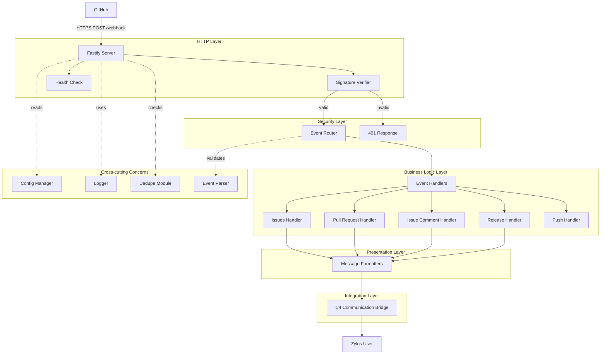

<!-- generated-by: gsd-doc-writer -->
# Architecture

## System Overview

Zylos GitHub Connector 是一个单向事件驱动的 Webhook 接收器，用于将 GitHub 事件转换为 Zylos AI Agent 平台的通知消息。系统采用**分层架构**（Layered Architecture），主要职责包括：接收 GitHub webhook 请求、验证 HMAC-SHA256 签名、路由事件类型、格式化消息并通过通信桥转发给用户。

**主要输入：** GitHub webhook HTTPS POST 请求（JSON 格式）
**主要输出：** 格式化的通知消息（通过 C4 通信桥）
**架构风格：** 事件驱动的分层架构，采用确认优先（ack-first）模式处理外部请求
**进程管理：** PM2 进程管理器，支持自动重启和日志管理

## Component Diagram



## Data Flow

### 典型请求处理流程

1. **GitHub 发送 Webhook**
   - GitHub 触发事件（如 Issue 创建）
   - 发送 HTTPS POST 请求到 `/webhook` 端点
   - 请求头包含：`X-Hub-Signature-256`（签名）、`X-GitHub-Event`（事件类型）、`X-GitHub-Delivery`（投递 ID）

2. **Fastify 服务器接收**
   - 使用自定义内容类型解析器捕获**原始请求体**（`req.rawBody`）
   - 解析 JSON 但保留原始字节用于 HMAC 验证
   - 请求体大小限制：10MB（可通过 `maxPayloadSize` 配置）

3. **事件元数据提取**
   - `event-parser.js` 模块提取事件类型和投递 ID
   - 验证事件类型是否在支持列表中
   - 提供统一的元数据接口

4. **签名验证**
   - 使用 `verifier.js` 中的 `verifySignature()` 函数
   - 从配置中获取 `webhookSecret`
   - 使用 `crypto.timingSafeEqual()` 进行常量时间比较（防止时序攻击）
   - 验证失败返回 401，验证成功继续处理

5. **去重检查**
   - 使用 `X-GitHub-Delivery` ID 检查是否已处理
   - 基于 Map 的内存去重（支持 TTL 清理）
   - 如果重复，返回 200 并跳过处理

6. **事件路由**
   - `router.js` 根据事件类型分发到对应处理器
   - 支持通配符处理器处理未注册事件
   - 处理器包括：issues、pull_request、issue_comment、release、push

7. **异步处理**
   - 立即返回 202 Accepted（确认优先模式）
   - 避免超时：GitHub 要求在 10 秒内响应
   - 消息传递在后台异步完成

8. **消息转发**
   - 格式化消息（使用 `formatters/` 模块）
   - 通过 C4 通信桥发送（带重试机制）
   - 记录处理结果

### 错误处理流程

- **签名无效：** 返回 401 Unauthorized，记录警告日志
- **Secret 未配置：** 返回 500 Internal Server Error，记录错误日志
- **验证异常：** 返回 500，记录错误详情（不包含敏感数据）
- **服务器错误：** 捕获未处理异常，触发优雅关闭
- **处理器错误：** 返回 500，保留原始错误并添加上下文

## Key Abstractions

### 核心模块

| 模块 | 文件位置 | 职责 |
|------|----------|------|
| **Fastify Server** | `src/index.js` | HTTP 服务器、路由注册、生命周期管理 |
| **Config Manager** | `src/lib/config.js` | 配置加载、热重载、环境变量覆盖 |
| **Signature Verifier** | `src/lib/verifier.js` | HMAC-SHA256 签名验证、常量时间比较 |
| **Event Parser** | `src/lib/event-parser.js` | 事件元数据提取和验证 |
| **Event Router** | `src/lib/router.js` | 事件类型路由、通配符支持 |
| **Dedupe Module** | `src/lib/dedupe.js` | 基于 Map 的去重、TTL 清理 |
| **Event Handlers** | `src/lib/handlers/` | GitHub 事件处理逻辑 |
| **Message Formatters** | `src/lib/formatters/` | 消息格式化和模板 |
| **Comm Bridge** | `src/lib/comm-bridge.js` | C4 通信桥集成 |

### 关键接口

#### Event Parser (`src/lib/event-parser.js`)

```javascript
// 获取事件类型
function getEventType(headers)

// 获取投递 ID
function getDeliveryId(headers)

// 验证事件类型
function isValidEventType(eventType)

// 提取所有元数据
function extractEventMetadata(headers)
```

#### Signature Verifier (`src/lib/verifier.js`)

```javascript
// 计算期望的 HMAC 签名
function computeHmac(rawBody, secret)

// 验证 GitHub webhook 签名（核心安全函数）
function verifySignature(rawBody, signature, secret)

// 提取签名头值
function extractSignature(signatureHeader)

// 获取调试信息（不包含敏感数据）
function getSignatureDebugInfo(rawBody, signature, secret)
```

#### Event Router (`src/lib/router.js`)

```javascript
// 注册事件处理器
function registerHandler(eventType, handler)

// 注册通配符处理器
function registerWildcardHandler(handler)

// 路由事件到处理器
async function routeEvent(eventType, payload)

// 检查处理器是否已注册
function hasHandler(eventType)

// 获取路由器统计信息
function getRouterStats()
```

#### Dedupe Module (`src/lib/dedupe.js`)

```javascript
// 检查投递 ID 是否已处理
function hasDeliveryBeenSeen(deliveryId)

// 标记投递 ID 为已处理
function markDeliveryAsSeen(deliveryId)

// 获取去重统计信息
function getDedupeStats()

// 清除所有已处理的 ID
function clearSeenDeliveries()

// 验证投递 ID 格式
function isValidDeliveryId(deliveryId)
```

#### Config Manager (`src/lib/config.js`)

```javascript
// 加载配置文件
async function loadConfig()

// 获取当前配置
function getConfig()

// 保存配置到文件
async function saveConfig(newConfig)

// 监听配置文件变化
function watchConfig(onChange)

// 停止监听配置变化
function stopWatching()
```

#### Event Handlers (`src/lib/handlers/`)

```javascript
// Issues 事件处理
async function handleIssuesEvent(payload)

// Pull Request 事件处理
async function handlePullRequestEvent(payload)

// Issue Comment 事件处理
async function handleCommentEvent(payload)

// Release 事件处理
async function handleReleaseEvent(payload)

// Push 事件处理（占位符）
async function handlePush(payload)

// 不支持事件的通配符处理器
async function handleUnsupported(eventType, payload)
```

### 设计模式

1. **确认优先模式（Ack-First）：** 立即返回 202，异步处理业务逻辑
2. **热重载模式（Hot Reload）：** 配置文件变更时自动重新加载
3. **优雅关闭（Graceful Shutdown）：** 10 秒超时保护，强制退出机制
4. **重试模式（Retry）：** C4 通信桥调用失败时自动重试
5. **路由器模式（Router）：** 灵活的事件处理器注册和分发
6. **TTL 清理模式：** 定期清理过期的去重条目，防止内存泄漏

## Directory Structure Rationale

```
src/
├── index.js              # 应用入口：启动服务器、注册路由、信号处理
└── lib/
    ├── config.js         # 配置管理：加载、热重载、默认值
    ├── verifier.js       # 安全核心：签名验证（时序攻击防护）
    ├── event-parser.js   # 事件元数据提取和验证
    ├── router.js         # 事件路由：类型分发、通配符支持
    ├── dedupe.js         # 去重模块：Map 存储、TTL 清理
    ├── handlers/         # 事件处理程序
    │   ├── index.js      # 处理器导出：push、issues、pr、comment、release
    │   ├── issues.js     # Issues 事件处理
    │   ├── pull-request.js  # PR 事件处理
    │   ├── comment.js    # Comment 事件处理
    │   └── release.js    # Release 事件处理
    ├── formatters/       # 消息格式化
    │   ├── index.js      # 格式化器导出
    │   ├── base.js       # 基础格式化器
    │   ├── url.js        # URL 格式化
    │   ├── actions.js    # 动作标签格式化
    │   └── labels.js     # 标签格式化
    ├── comm-bridge.js    # C4 通信桥集成
    └── __tests__/        # 单元测试
scripts/                  # 工具脚本：测试、PM2 管理
├── pm2-test.sh          # PM2 集成测试脚本
├── test-webhook.js      # Webhook 测试工具
└── send.js              # 测试接口（绕过 C4）
hooks/                    # 生命周期钩子：安装、升级、配置
├── configure.js         # 配置钩子
├── post-install.js      # 安装后钩子
├── post-upgrade.js      # 升级后钩子
└── pre-upgrade.js       # 升级前钩子
tests/                    # 集成测试和单元测试
├── integration/         # 集成测试
├── unit/                # 单元测试
└── fixtures/            # 测试数据
docs/                     # 项目文档：架构、开发指南
ecosystem.config.cjs      # PM2 进程管理配置
```

### 设计原则

- **`src/index.js`** - 单一入口点，负责初始化和关闭流程，不包含业务逻辑
- **`src/lib/`** - 可重用的核心模块，每个文件有单一职责
- **`src/lib/handlers/`** - 按事件类型组织的处理器，每个处理器独立可测试
- **`src/lib/formatters/`** - 集中式消息格式化，确保一致的消息格式
- **`src/lib/__tests__/`** - 测试与源代码并列放置，便于维护
- **`scripts/`** - 开发和测试工具，包括 PM2 测试脚本
- **`hooks/`** - 与 Zylos 平台集成，处理安装和升级流程
- **`tests/`** - 集成测试和单元测试分离，测试数据独立管理

### 安全隔离

- **配置路径**：`~/zylos/components/github-connector/config.json`（用户主目录）
- **敏感数据**：Webhook secret 仅在内存中持有，永不记录到日志
- **原始体捕获**：在解析前保存原始字节，确保 HMAC 验证的完整性
- **常量时间比较**：使用 `crypto.timingSafeEqual()` 防止时序攻击

### 进程管理

- **PM2 配置**：`ecosystem.config.cjs` 定义 PM2 应用配置
- **自动重启**：失败后最多重启 10 次，延迟 5 秒
- **日志管理**：错误日志和输出日志分别记录到 `logs/` 目录
- **优雅关闭**：支持 SIGINT 和 SIGTERM 信号，10 秒超时保护
- **去重清理**：每 5 分钟清理超过 1 小时的去重条目

## Configuration Flow

```
1. 应用启动
   ↓
2. 读取 ~/zylos/components/github-connector/config.json
   ↓
3. 与 DEFAULT_CONFIG 深度合并
   ↓
4. 应用环境变量覆盖 (GITHUB_WEBHOOK_SECRET)
   ↓
5. 验证必需字段（webhookSecret 长度、port 范围）
   ↓
6. 启动配置文件监听器（500ms 防抖）
   ↓
7. 文件变更时触发热重载
   ↓
8. 端口变更时记录警告（需要重启）
   ↓
9. enabled=false 时触发关闭
```

## Security Architecture

### 签名验证流程

```
GitHub Request
    ↓
捕获原始请求体 (req.rawBody)
    ↓
提取 X-Hub-Signature-256 头
    ↓
computeHmac(rawBody, secret)
    ↓
crypto.timingSafeEqual(expected, received)
    ↓
true → 继续处理
false → 返回 401
```

### 安全措施

1. **常量时间比较** - 防止时序攻击
2. **原始体验证** - 验证未解析的原始字节，防止 JSON 注入攻击
3. **密钥隔离** - Secret 仅在内存中，永不记录
4. **Helmet 集成** - 自动添加安全 HTTP 头
5. **超时保护** - 优雅关闭 10 秒超时，防止挂起
6. **输入验证** - 所有处理器验证输入数据结构
7. **错误隔离** - 错误日志不包含敏感信息
8. **Shell 转义** - C4 通信桥调用时正确转义单引号

## Extension Points

### 已实现模块

- **`src/lib/event-parser.js`** - 事件元数据提取和验证
- **`src/lib/dedupe.js`** - 基于 Map 的去重逻辑，支持 TTL 清理
- **`src/lib/router.js`** - 灵活的事件路由系统，支持通配符
- **`src/lib/handlers/`** - 事件类型处理器（issues、pull_request、issue_comment、release、push）
- **`src/lib/formatters/`** - 消息模板和格式化函数
- **`src/lib/comm-bridge.js`** - C4 通信桥集成
- **`hooks/`** - 生命周期钩子系统
- **`ecosystem.config.cjs`** - PM2 进程管理配置

### 未来扩展

- Redis 持久化去重
- 事件过滤规则
- 自定义消息模板
- 多仓库支持
- Webhook 管理界面
- Push 事件处理器完整实现
- 更多 GitHub 事件类型支持

## Dependencies

### 运行时依赖

- **`fastify`** (v5.8.5) - 高性能 Web 框架
- **`@fastify/helmet`** (v13.0.2) - 安全 HTTP 头中间件
- **`fastify-raw-body`** (v5.0.0) - 原始请求体捕获
- **`crypto`** (Node.js 内置) - HMAC-SHA256 签名计算

### 开发依赖

- **`pino-pretty`** (v13.1.3) - 日志格式化工具

### 进程管理依赖

- **`pm2`** - 进程管理器（需要全局安装）

### Node.js 要求

- **Node.js >= 20.0.0**（在 `package.json` 的 `engines` 字段中声明）

## Communication Flow

### C4 Communication Bridge

```
Handler → Formatter → Comm Bridge → C4 Receive Script → User
              ↓
         Message Object
         - type: "github" (pending channel registration)
         - repository: full_name
         - event: event_type
         - action: action
         - message: formatted_text
         - url: resource_url
```

### 重试机制

- **最大重试次数：** 2
- **重试延迟：** 500ms
- **超时时间：** 3000ms
- **失败处理：** 记录错误并继续（不阻塞 webhook 响应）
- **Shell 安全：** 单引号转义防止命令注入

## Lifecycle Management

### PM2 集成

```javascript
// ecosystem.config.cjs
{
  name: 'zylos-github-connector',
  script: 'src/index.js',
  autorestart: true,
  max_restarts: 10,
  restart_delay: 5000,
  error_file: 'logs/error.log',
  out_file: 'logs/out.log',
  log_date_format: 'YYYY-MM-DD HH:mm:ss'
}
```

### 优雅关闭流程

```
SIGINT/SIGTERM
    ↓
设置关闭标志
    ↓
启动 10 秒超时定时器
    ↓
清除去重清理定时器
    ↓
停止配置文件监听
    ↓
关闭 Fastify 服务器
    ↓
清除超时定时器
    ↓
process.exit(0)
```

### 去重清理机制

- **清理间隔：** 5 分钟
- **保留时间：** 1 小时
- **数据结构：** Map<deliveryId, timestamp>
- **清理触发：** 定时器自动执行
- **日志记录：** 记录清理数量和剩余条目数

## Testing Strategy

### 单元测试

- **位置：** `src/lib/__tests__/`
- **覆盖模块：** verifier、router、dedupe、event-parser、comm-bridge
- **测试框架：** Node.js 内置 `node:test`
- **运行命令：** `npm test`

### 集成测试

- **位置：** `tests/integration/`
- **测试场景：** 端到端 webhook 处理
- **测试工具：** `scripts/test-webhook.js`
- **运行命令：** `npm run test:webhook`

### PM2 集成测试

- **位置：** `scripts/pm2-test.sh`
- **测试场景：** PM2 启动、停止、重启、删除
- **测试数量：** 16 个测试用例
- **运行命令：** `bash scripts/pm2-test.sh`

## Performance Considerations

### 内存管理

- **去重模块：** 定期清理过期条目，防止内存泄漏
- **请求体限制：** 默认 10MB，可配置
- **日志级别：** 生产环境建议使用 `info` 或 `warn`

### 并发处理

- **Fastify：** 高性能异步处理
- **确认优先：** 立即返回 202，不阻塞 GitHub
- **异步转发：** C4 通信桥调用不阻塞响应

### 错误恢复

- **PM2 自动重启：** 最多 10 次重启尝试
- **优雅关闭：** 10 秒超时保护
- **配置热重载：** 无需重启即可更新配置
